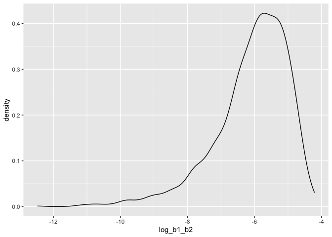

p8105_hw6_tem2171
================
Teresa Moore
2023-11-28

``` r
library(tidyverse)
```

    ## ── Attaching core tidyverse packages ──────────────────────── tidyverse 2.0.0 ──
    ## ✔ dplyr     1.1.3     ✔ readr     2.1.4
    ## ✔ forcats   1.0.0     ✔ stringr   1.5.0
    ## ✔ ggplot2   3.4.3     ✔ tibble    3.2.1
    ## ✔ lubridate 1.9.2     ✔ tidyr     1.3.0
    ## ✔ purrr     1.0.2     
    ## ── Conflicts ────────────────────────────────────────── tidyverse_conflicts() ──
    ## ✖ dplyr::filter() masks stats::filter()
    ## ✖ dplyr::lag()    masks stats::lag()
    ## ℹ Use the conflicted package (<http://conflicted.r-lib.org/>) to force all conflicts to become errors

``` r
library(modelr)

set.seed(1)
```

\#Problem 2

For this problem, we’ll use the Central Park weather data similar to
data we’ve seen elsewhere. The code chunk below (adapted from the course
website) will download these data.

``` r
weather_df = 
  rnoaa::meteo_pull_monitors(
    c("USW00094728"),
    var = c("PRCP", "TMIN", "TMAX"), 
    date_min = "2022-01-01",
    date_max = "2022-12-31") |>
  mutate(
    name = recode(id, USW00094728 = "CentralPark_NY"),
    tmin = tmin / 10,
    tmax = tmax / 10) |>
  select(name, id, everything())
```

    ## using cached file: /Users/tessamoore/Library/Caches/org.R-project.R/R/rnoaa/noaa_ghcnd/USW00094728.dly

    ## date created (size, mb): 2023-11-30 09:24:39.945282 (8.544)

    ## file min/max dates: 1869-01-01 / 2023-11-30

Use 5000 bootstrap samples and, for each bootstrap sample, produce
estimates of these two quantities.

Let’s write a quick function to generate our bootstrap samples.

``` r
boot_sample <- function(df) {
  sample_frac(df, replace = TRUE)
}
```

``` r
boot_straps = 
  tibble(strap_number = 1:5000) |> 
  mutate(
    strap_sample = map(strap_number, \(i) boot_sample(df = weather_df))
  )
```

``` r
tidy_bootstrap_results = 
  boot_straps |> 
  mutate(
    models = map(strap_sample, \(df) lm(tmax ~ tmin + prcp, data = df)),
    results = map(models, broom::tidy)) |> 
  select(-strap_sample, -models) |> 
  unnest(results) |>
  select(strap_number, term, estimate) |> 
  pivot_wider(
    names_from = term,
    values_from = estimate
  ) |> 
  mutate(log_b1_b2 = log(tmin * prcp)) |> 
  select(strap_number, log_b1_b2)
```

    ## Warning: There was 1 warning in `mutate()`.
    ## ℹ In argument: `log_b1_b2 = log(tmin * prcp)`.
    ## Caused by warning in `log()`:
    ## ! NaNs produced

``` r
glance_bootstrap_results =
  boot_straps |> 
  mutate(
    models = map(strap_sample, \(df) lm(tmax ~ tmin + prcp, data = df)),
    results = map(models, broom::glance),
  ) |> 
  select(strap_number, results) |> 
  unnest(results) |>
  select(strap_number, r2 = r.squared)

bootstrap_results =
  inner_join(tidy_bootstrap_results, glance_bootstrap_results)
```

    ## Joining with `by = join_by(strap_number)`

R^2 Distribution

``` r
bootstrap_results |> 
  ggplot(aes(x = r2)) + 
  geom_density() +
  labs(title = "R^2 distribution")
```

<!-- -->
This distribution is slightly left skewed, with a light tail extending
to low values. It is almost a normal distribution.

log(B1\*B2) Distribution

``` r
bootstrap_results |> 
  ggplot(aes(x = log_b1_b2)) + 
  geom_density() +
  labs(title = "Log(B1 * B2) distribution")
```

    ## Warning: Removed 3361 rows containing non-finite values (`stat_density()`).

<!-- -->

This distribution is extremely left skewed, with a heavy tail extending
to low values.

``` r
bootstrap_results |> 
  summarize(
    r2_ci_lower = quantile(r2, 0.025),
    r2_ci_upper = quantile(r2, 0.975),
    log_b1_b2_ci_lower = quantile(log_b1_b2, 0.025, na.rm=TRUE),
    log_b1_b2_ci_upper = quantile(log_b1_b2, 0.975,na.rm=TRUE)
  ) |> 
  knitr::kable(digits = 3)
```

| r2_ci_lower | r2_ci_upper | log_b1_b2_ci_lower | log_b1_b2_ci_upper |
|------------:|------------:|-------------------:|-------------------:|
|       0.889 |       0.941 |             -8.982 |             -4.602 |

The 95% confidence interval for r̂ 2 is between 0.889 and 0.941.The 95%
confidence interval for log(β̂1∗β̂2) is between -8.982 and -4.602.
