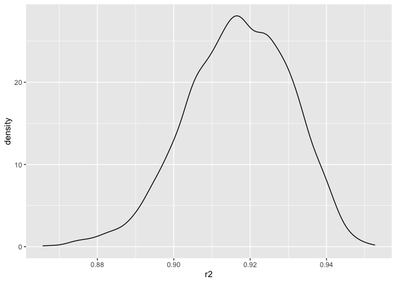
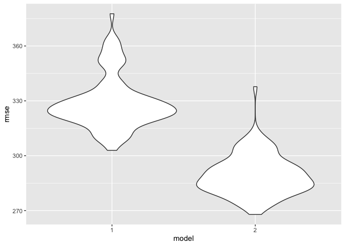

p8105_hw6_tem2171
================
Teresa Moore
2023-11-28

# Problem 2

For this problem, we’ll use the Central Park weather data similar to
data we’ve seen elsewhere. The code chunk below (adapted from the course
website) will download these data.

``` r
weather_df = 
  rnoaa::meteo_pull_monitors(
    c("USW00094728"),
    var = c("PRCP", "TMIN", "TMAX"), 
    date_min = "2022-01-01",
    date_max = "2022-12-31") |>
  mutate(
    name = recode(id, USW00094728 = "CentralPark_NY"),
    tmin = tmin / 10,
    tmax = tmax / 10) |>
  select(name, id, everything())
```

    ## using cached file: /Users/tessamoore/Library/Caches/org.R-project.R/R/rnoaa/noaa_ghcnd/USW00094728.dly

    ## date created (size, mb): 2023-11-30 09:24:39.945282 (8.544)

    ## file min/max dates: 1869-01-01 / 2023-11-30

Use 5000 bootstrap samples and, for each bootstrap sample, produce
estimates of these two quantities.

Let’s write a quick function to generate our bootstrap samples.

``` r
boot_sample <- function(df) {
  sample_frac(df, replace = TRUE)
}
```

make a list column to make a data structure to keep track of everything.

``` r
boot_straps = 
  tibble(strap_number = 1:5000) |> 
  mutate(
    strap_sample = map(strap_number, \(i) boot_sample(df = weather_df))
  )
```

produce estimates of r̂ 2 & log(β̂ 1∗β̂ 2) for each sample.

``` r
tidy_bootstrap_results = 
  boot_straps |> 
  mutate(
    models = map(strap_sample, \(df) lm(tmax ~ tmin + prcp, data = df)),
    results = map(models, broom::tidy)) |> 
  select(-strap_sample, -models) |> 
  unnest(results) |>
  select(strap_number, term, estimate) |> 
  pivot_wider(
    names_from = term,
    values_from = estimate
  ) |> 
  mutate(log_b1_b2 = log(tmin * prcp)) |> 
  select(strap_number, log_b1_b2)
```

    ## Warning: There was 1 warning in `mutate()`.
    ## ℹ In argument: `log_b1_b2 = log(tmin * prcp)`.
    ## Caused by warning in `log()`:
    ## ! NaNs produced

``` r
glance_bootstrap_results =
  boot_straps |> 
  mutate(
    models = map(strap_sample, \(df) lm(tmax ~ tmin + prcp, data = df)),
    results = map(models, broom::glance),
  ) |> 
  select(strap_number, results) |> 
  unnest(results) |>
  select(strap_number, r2 = r.squared)

bootstrap_results =
  inner_join(tidy_bootstrap_results, glance_bootstrap_results)
```

    ## Joining with `by = join_by(strap_number)`

## R^2 Distribution

``` r
bootstrap_results |> 
  ggplot(aes(x = r2)) + 
  geom_density()
```

<!-- -->

This distribution is slightly left skewed, with a light tail extending
to low values. It is almost a normal distribution.

## log(B1\*B2) Distribution

``` r
bootstrap_results |> 
  ggplot(aes(x = log_b1_b2)) + 
  geom_density()
```

    ## Warning: Removed 3361 rows containing non-finite values (`stat_density()`).

<!-- -->

This distribution is extremely left skewed, with a heavy tail extending
to low values.

``` r
bootstrap_results |> 
  summarize(
    r2_ci_lower = quantile(r2, 0.025),
    r2_ci_upper = quantile(r2, 0.975),
    log_b1_b2_ci_lower = quantile(log_b1_b2, 0.025, na.rm=TRUE),
    log_b1_b2_ci_upper = quantile(log_b1_b2, 0.975,na.rm=TRUE)
  ) |> 
  knitr::kable(digits = 3)
```

| r2_ci_lower | r2_ci_upper | log_b1_b2_ci_lower | log_b1_b2_ci_upper |
|------------:|------------:|-------------------:|-------------------:|
|       0.889 |       0.941 |             -8.982 |             -4.602 |

The 95% confidence interval for r̂ 2 is between 0.889 and 0.941.The 95%
confidence interval for log(β̂1∗β̂2) is between -8.982 and -4.602.

# Problem 3

Load and clean the data for regression analysis (i.e. convert numeric to
factor where appropriate, check for missing data, etc.).

``` r
birthweight <- read.csv("data/birthweight.csv")

birthweight |>
  janitor::clean_names() |>
  mutate(
    babysex = as.factor(babysex),
    frace = as.factor(frace),
    malform = as.factor(malform),
    mrace = as.factor(mrace)
  ) |>
  drop_na()
```

``` r
fit = lm(bwt ~ babysex + gaweeks + ppbmi + wtgain + blength, data = birthweight)

fit |>
  broom::tidy() |>
  select(term, estimate, p.value) |>
  knitr::kable(digits=3)
```

| term        |  estimate | p.value |
|:------------|----------:|--------:|
| (Intercept) | -4347.335 |    0.00 |
| babysex     |   -17.030 |    0.09 |
| gaweeks     |    25.701 |    0.00 |
| ppbmi       |     8.340 |    0.00 |
| wtgain      |     4.797 |    0.00 |
| blength     |   124.379 |    0.00 |

Proposed a regression model for birthweight: bwt= intercept + babysex +
gaweeks + ppbmi + wtgain + blength. I chose these variables because I
believe they would have the most impact on birth weight.

## Plot of model residuals against fitted values:

``` r
birthweight |>
  modelr::add_residuals(fit) |>
  modelr::add_predictions(fit) |>
  ggplot(aes(x=resid, y=pred)) + geom_point(alpha=0.5, size=0.5)
```

<!-- -->

the plot of model residuals vs fitted values is clustered around 0, with
the average predicted value being approximately 3200 g. The cluster is
pretty tight, however there are some outliars.

## Comparison of model to one using length at birth and gestational age as predictors (main effects only):

``` r
cv1_df = 
  crossv_mc(birthweight, 100) 

cv1_df |> 
  mutate(
    mod_1  = map(train, \(df) lm(bwt ~ babysex + gaweeks + ppbmi + wtgain + blength, data = df)),
    mod_2  = map(train, \(df) lm(bwt ~ blength + gaweeks, data=df))) |> 
  mutate(
    rmse_1 = map2_dbl(mod_1, test, \(mod, df) rmse(model = mod, data = df)),
    rmse_2 = map2_dbl(mod_2, test, \(mod, df) rmse(model = mod, data = df))) |>
  select(starts_with("rmse")) |>
  pivot_longer(
    everything(), names_to="model", values_to="rmse", names_prefix="rmse_") |>
  ggplot(aes(x=model, y=rmse)) + geom_violin()
```

<!-- -->

My model has a lower RMSE value than the model using length at birth and
gestational age as predictors.

## Comparison of model to one using head circumference, length, sex, and all interactions (including the three-way interaction) between these:

``` r
cv2_df = 
  crossv_mc(birthweight, 100) 

cv2_df |> 
  mutate(
    mod_1  = map(train, \(df) lm(bwt ~ babysex + gaweeks + ppbmi + wtgain + blength, data = df)),
    mod_2  = map(train, \(df) lm(bwt ~ bhead + blength + babysex + bhead*blength + bhead*babysex + blength*babysex + bhead*blength*babysex, data=df))) |>
  mutate(
    rmse_1 = map2_dbl(mod_1, test, \(mod, df) rmse(model = mod, data = df)),
    rmse_2 = map2_dbl(mod_2, test, \(mod, df) rmse(model = mod, data = df))) |>
  select(starts_with("rmse")) |>
  pivot_longer(
    everything(), names_to="model", values_to="rmse", names_prefix="rmse_") |>
  ggplot(aes(x=model, y=rmse)) + geom_violin()
```

<!-- -->

My model has a much higher RMSE value than the model using head
circumference, length, sex, and all interactions (including the
three-way interaction) between these. Ultimately, the model with
interaction terms appears to be the best model.
